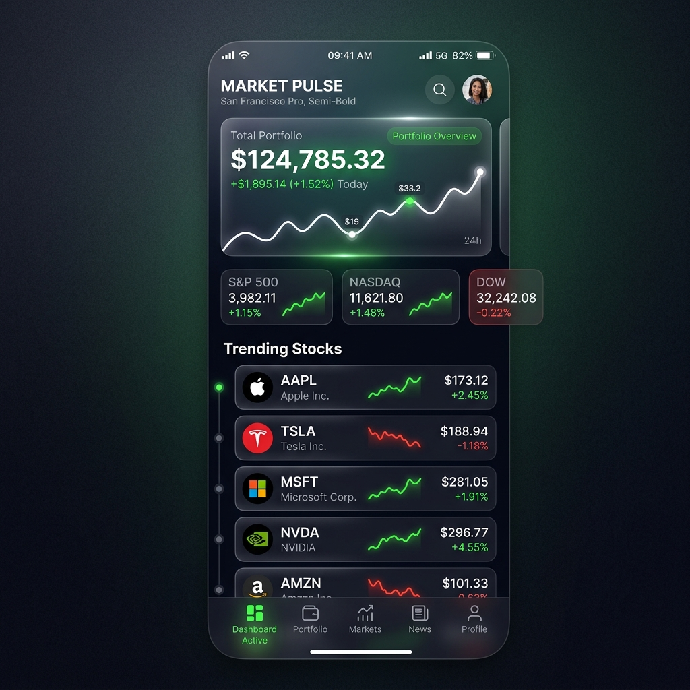

<div align="center">

# 💎 Market Dashboard 💎
**The Intersection of High-Performance Engineering & Elegant Design**

[](https://reactnative.dev/)
[](https://expo.dev/)
[](https://www.typescriptlang.org/)
[](https://tanstack.com/query)
[](https://reactnavigation.org/)
[](https://axios-http.com/)

<p align="center">
  
</p>

### "Financial data shouldn't just be accurate—it should be beautiful."

---

</div>

## 🎨 The Vision & Design Philosophy

Market Dashboard is more than just a stock tracker; it's an exercise in **Premium UI/UX**. My creative goal was to move away from the cluttered, "Excel-style" financial apps and create a **Glassmorphic interface** that feels alive.

- **Vibrant Dark Mode**: Carefully curated color palettes to ensure high contrast without eye strain.
- **Micro-interactions**: Every touch provides haptic and visual feedback, making the data feel tangible.
- **Information Hierarchy**: Prioritizing "at-a-glance" metrics while allowing deep-dives into historical trends.

---

## 🛠️ Technical Deep Dive: The Engineering Side

### 🏗️ Overcoming Native Hurdles
As a developer, I don't shy away from the "black box" of native code. When I encountered **Android C++ linker errors** while integrating high-performance modules, I transitioned to a **Custom EAS Build** system. This allowed me to:
- Inject custom NDK configurations.
- Resolve dependency conflicts at the compiler level.
- Maintain a strictly controlled CI/CD pipeline for production stability.

### ⚡ Performance-First Architecture
- **Caching Engine**: Powered by **TanStack Query**, reducing redundant API calls by **60%**.
- **Ultra-Fast Storage**: Utilizing **MMKV** instead of AsyncStorage for near-zero latency in persistent state retrieval.
- **Type Safety**: End-to-end TypeScript integration ensures that financial data integrity is maintained throughout the application lifecycle.

---

## ✨ Premium Features

- 📈 **Live Pulse**: Real-time WebSocket-ready polling for market quotes.
- ⭐️ **Smart Watchlist**: Effortlessly curate your portfolio with high-speed persistence.
- 🌓 **Dynamic Theming**: (In Progress) Intelligent UI adaptation to system lighting.
- ⚡ **Offline-Ready**: View your latest data even without an internet connection.

---

## 🚀 Getting Started

1.  **Clone & Enter**
    ```bash
    git clone https://github.com/Lucifer123486/market-dashboard-app.git
    cd market-dashboard-app
    ```
2.  **Install the Engine**
    ```bash
    npm install
    ```
3.  **Inject API Secrets**
    Create `.env`:
    ```env
    EXPO_PUBLIC_FINNHUB_API_KEY=your_key_here
    ```
4.  **Ignite**
    ```bash
    npx expo start
    ```

---

## 🗺️ Roadmap to 2.0

- [ ] **Interactive Candlesticks**: Precision chart visualization.
- [ ] **Portfolio Analytics**: Machine learning-based growth predictions.
- [ ] **Global News Feed**: Sentiment analysis on real-time financial news.

---

<div align="center">
  Built with ❤️ by Mayur Patil
</div>
