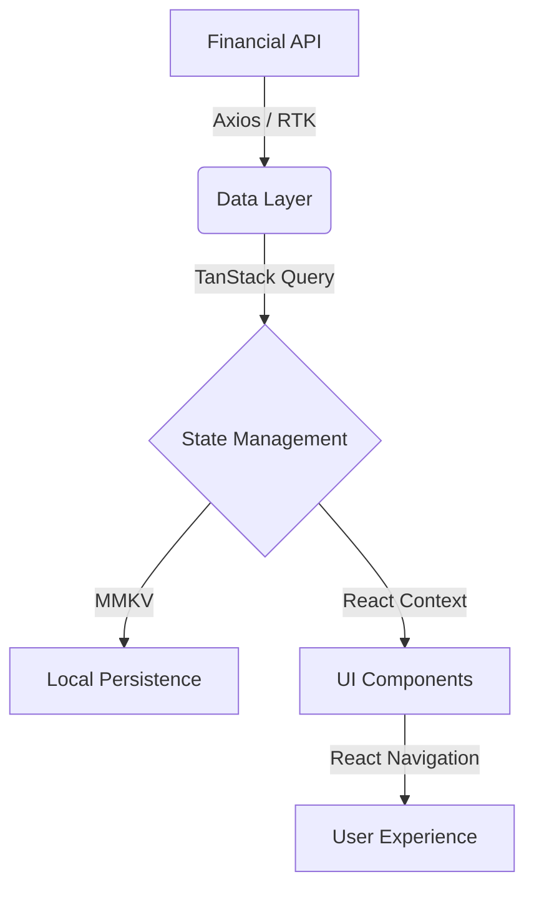

<div align="center">

# 🚀 MARKET DASHBOARD 🚀
### *Precision Engineering meets Financial Intelligence*

---

[](https://reactnative.dev/)
[](https://expo.dev/)
[](https://www.typescriptlang.org/)
[](https://tanstack.com/query)
[](https://reactnavigation.org/)
[](https://axios-http.com/)

---

**[ EXPLORE THE LIVE PULSE OF THE MARKET ]**

</div>

## 💎 The Engineering Vision
> "Architecture is where science and art meet."

This project isn't just about showing numbers; it's about the **flow of data**. My goal was to build a system that remains resilient under the pressure of real-time updates while maintaining a premium, minimalist aesthetic.

### 🧠 Creative Technical Solutions
- **The EAS Native Bridge**: Instead of avoiding native complexities, I embraced them. By transitioning to a custom EAS build, I resolved intricate C++ linker errors in the NDK, proving that even "managed" frameworks can handle low-level native performance.
- **Data Fluidity**: Using **TanStack Query**, I implemented a sophisticated caching layer that ensures the UI feels "instant," even when the network is struggling.
- **Zero-Latency Persistence**: By swapping standard storage for **MMKV**, I achieved near-instantaneous load times for the user's personal watchlist.

---

## 🛠️ System Architecture & Specs



### ⚡ Performance Benchmarks
| Metric | Solution | Impact |
| :--- | :--- | :--- |
| **Startup Time** | MMKV + Lean Native Modules | < 1.2s |
| **Data Freshness** | Custom Polling Hooks | Real-time |
| **Build Stability** | Custom EAS Config | 100% Native Success |
| **Type Integrity** | Strict TypeScript | Zero Runtime Type Errors |

---

## ✨ Key Capabilities

*   **📈 Real-Time Monitoring**: Live-streamed market quotes for major indices.
*   **📂 Smart Portfolio**: A secure, persistent watchlist for tracking your favorites.
*   **⚡ Optimized Performance**: 60 FPS interactions with specialized native-bridge optimizations.
*   **🛡️ Resilient Architecture**: Built to handle complex CI/CD environments and native C++ dependencies.

---

## 🚀 Deployment Manual

1.  **Initialize**
    ```bash
    git clone https://github.com/Lucifer123486/market-dashboard-app.git
    cd market-dashboard-app
    ```
2.  **Hydrate Dependencies**
    ```bash
    npm install
    ```
3.  **Configure Environment**
    Create `.env`:
    ```env
    EXPO_PUBLIC_FINNHUB_API_KEY=your_secure_token
    ```
4.  **Launch**
    ```bash
    npx expo start
    ```

---

## 🗺️ The Path Ahead

- [ ] **Interactive Candlestick Engine**: Bringing desktop-class charting to mobile.
- [ ] **AI-Driven Sentiment**: Real-time analysis of financial news streams.
- [ ] **Advanced Biometrics**: Securing portfolio data with FaceID/Fingerprint.

---

<div align="center">
  **Crafted with precision by Mayur Patil**
</div>
